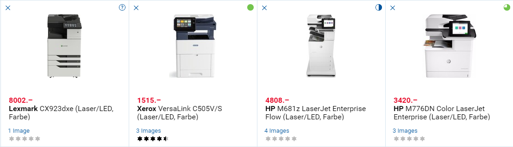
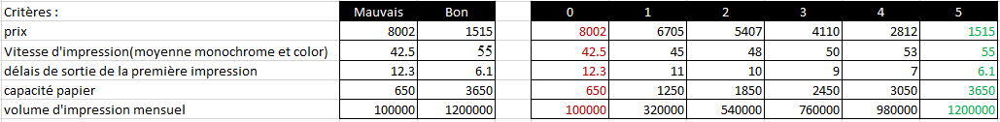
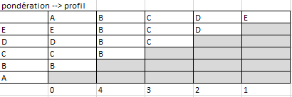
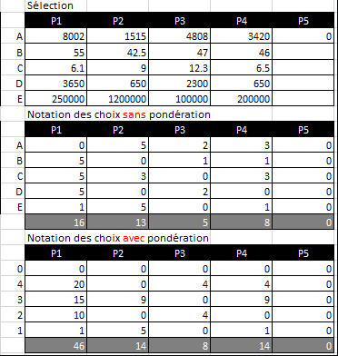

# Sélection d’imprimantes

## Objectifs

Mettre en œuvre un processus de décision dans le cadre du choix d’une imprimante en fonction de son utilisation.

## Déroulement

Réunir le maximum d'informations sur le sujet étudié. Définir les critères de sélection. Noter les solutions par rapport aux critères de sélection. Pondérer les critères selon l'importance qu'on leur accorde. Effectuer le total des cotations de tous les critères par solution. Choisir la solution qui présente le total le plus élevé.

## Exercice

Sélectionnez, sur le site http://www.arp.ch/fr/, quatre imprimantes adaptées à chacun des profils suivants. Faites ensuite une comparaison pour déterminer laquelle est la mieux adaptée dans chaque cas.

### Profil 1

Un particulier imprime quelques photos et une ou deux lettres par mois.

### Profil 2

Une PME veut équiper son bureau technique d’une imprimante permettant d’imprimer ses dossiers techniques et des plans (format A3) en Noir/Blanc. Ce bureau comprend trois techniciens qui impriment chacun cinq ou six dossiers par semaine d’environ soixante pages chacun.

### Profil 3 (Cyprien, Benjamin F., Kenan)

Une grande entreprise veut équiper son secrétariat central d’une imprimante à grand débit pour l’impression de tout le courrier de l’administration ainsi que les rapports de la direction et des finances contenant des graphiques en couleur. Il faudrait que cette imprimante puisse être utilisée comme photocopieuse également.

1. Choix des imprimantes (4)
    1. [Comparaison](https://www.digitec.ch/fr/Comparison/9890636-9348213-6362148-12485645)
    
2. Poser des critères (5)
    1. Kenan
        1. Vitesse d'impression✅
        2. Vitesse de numérisation
        3. capacité de papier(totale)✅
        4. consommation (veille)
        5. Délai première impression✅
    2. Benjamin
        1. Prix✅
        2. Vitesse d'impression (moyenne b/w & color)✅
        3. Délai de première impression✅
        4. capacité du papier total✅
        5. volume d'impression mensuel✅
    3. Cyprien
        1. Prix✅
        2. Vitesse d'impression (moyenne b/w & color)✅
        3. capacité du papier total✅
        4. Volume d'impression mensuel✅
        5. Résolution d'impréssion
    4. Commun
        1. Prix
        2. Vitesse d'impression
        3. Capacité totale
        4. Volume d'impression mensuel
        5. Délai de premiere impression
3. Matrice de pondération **sans** tenir compte du profile
   
4. Comparaison des critère "combats"
   
5. Présentations (3) des résultats
   

## Recommandations/contre-indications

Afin de réaliser un exercice pertinent, il faut que vous maitrisiez le mieux possible le sujet en question. Cela sera possible en se documentant et en réunissant le maximum d’information sur le sujet. Il est nécessaire de rester le plus objectif possible aussi bien pour les critères que pour les coefficients.

## Résultat à fournir

Un dossier comportant les caractéristiques des imprimantes sélectionnées, le choix retenu pour chacun des profils, tous les tableaux justificatifs ainsi qu’une conclusion expliquant les raisons de vos choix.
