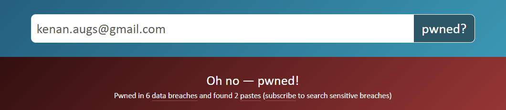
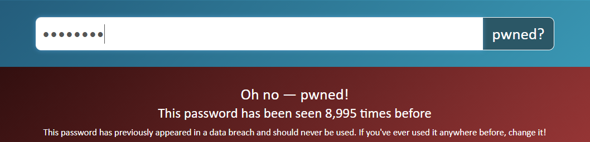

# Collection #1

Collection #1 est le nom d'une base de donnée d'adresses Email et de mots de passes qui est apparue sur le dark web en 2019. Elle est composée de données provenant de multiples fuites déjà connues ainsi que de nombreuses nouvelles fuites de donnée qui font d'elle la plus grande fuite collective à ce jour.

Cette base de donnée à été découverte et publiée par le chercheur en sécurité Troy Hunt qui est le créateur du site [Have i been pwned](https://haveibeenpwned.com/) qui permet de verifier si un email ou un mot de passe en clair s'est retrouvé dans une fuite de données. Dans son article, il présente l'amplitude de la fuite, son origine, les dangers potentiels qu'elle amène ainsi que des conseils pour se protéger.

## Quelques stats

-   2,692,818,238 entrées
-   1,160,253,228 combinaisons uniques
-   772,904,991 adresses email uniques
-   21,222,975 mots de passes uniques
-   12,000 fichiers
-   87 GB de données

## Have I been pwned

Le site have i been pwned permet aux utilisateurs de verifier si leur email apparaît dans des fuites et d'être avertis lorsque ils apparaissent dans de nouvelles fuites.

Il permet aussi de verifier le nombre de fois qu'un mot de passe est apparus en clair.

## Sources

[Wikipedia](https://en.wikipedia.org/wiki/Collection_No._1)
[Article complet par Troy Hunt](https://www.troyhunt.com/the-773-million-record-collection-1-data-reach/)
[Have i been pwned](https://haveibeenpwned.com/)
